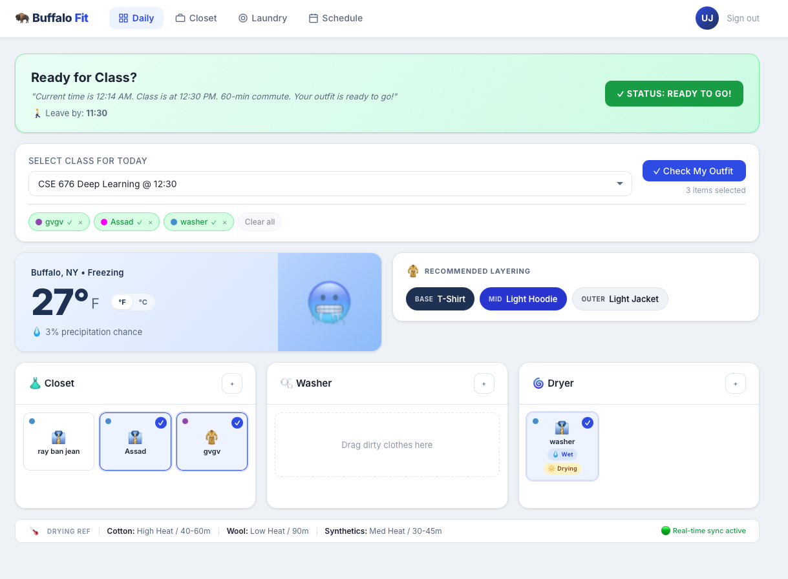
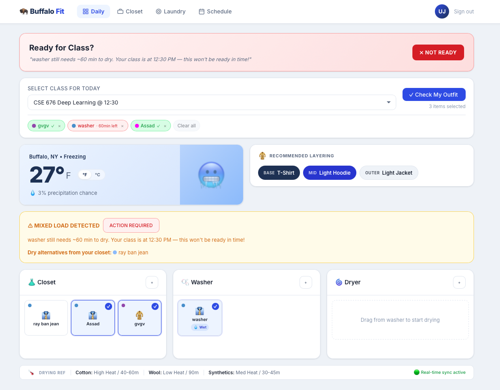
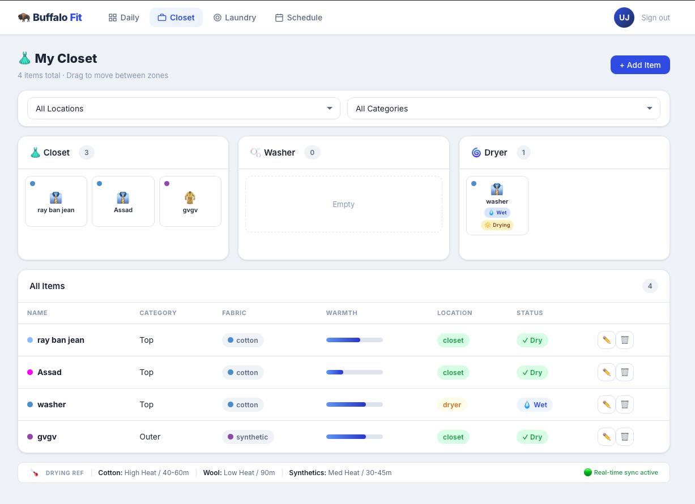
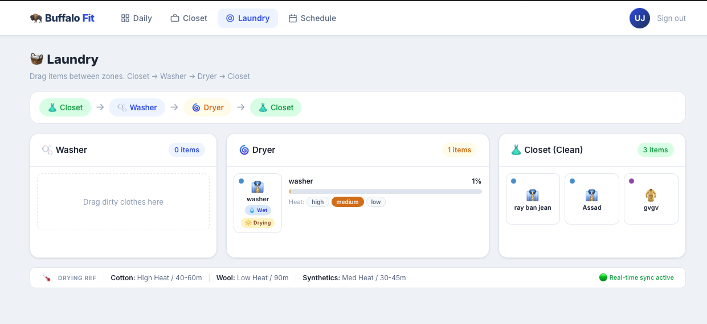
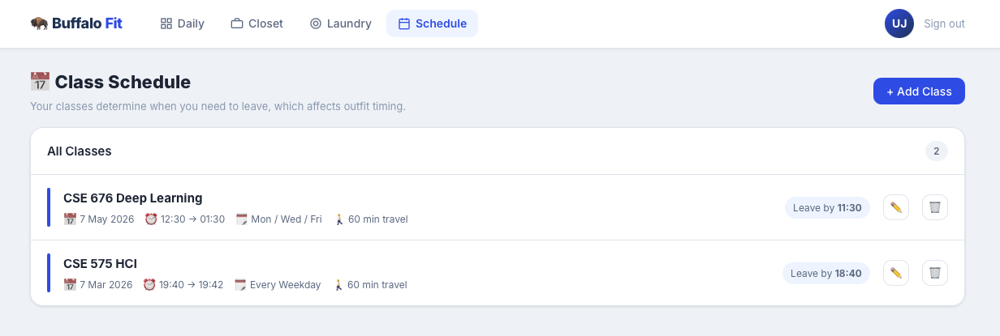

# BuffaloFit 🦬👕 

BuffaloFit is a full-stack, data-driven web application designed to help university students optimize their daily routines by managing their closet, tracking laundry drying times, and generating weather-appropriate outfit recommendations so they never leave for class late or underdressed.

## Project Inspiration

I originally came up with this idea because I have a lot of clothes in my closet and would often forget exactly what was clean, what was in the washer, and what was in the dryer. Thinking about what to wear is always a last minute scramble—especially living in Buffalo, where figuring out how to layer up so you don't feel freezing cold is an absolute must! 

I often wasted time trying to figure out if I should wait for my clothes to finish drying before class or just wear something else. I designed this web app starting with UI mockups in Stitch, and then rapidly developed the full stack application using Antigravity. By leveraging AI throughout the development cycle, I was able to ship this much quicker and learn advanced technologies from high level (like React and FastAPI) in just a few hours. Building this taught me that while syntax changes between languages, the fundamentals of how REST APIs work and how systems communicate remain exactly the same. 

## Technologies Used

This project was built leveraging modern, distributed data processing tools and frameworks:
- **Frontend Framework:** React.js with TypeScript, utilizing custom CSS architectures for a dynamic, component-based UI.
- **Backend Framework:** Python with FastAPI for building high performance, asynchronous REST APIs.
- **RESTful API Architecture:** Implemented standard HTTP methods to handle state distribution between the client side and the server.
- **Database Tools:** SQLite managed via SQLAlchemy ORM for robust relational data storage (no flat JSON files).
- **Data-Driven / AI-Enabled Features:** Integrated external APIs (Open-Meteo) to fetch real-ime weather data and calculate dynamic, logic-based layering recommendations.
- **Version Control:** Git 

---

# Features & Architecture

## Daily Dashboard (Outfit Readiness)

The core feature of the app is predicting if your clothes will be ready to wear before you have to leave.

**✅ Outfit Ready:**

*Appears (Green Alert) when your selected outfit is clean, dry, and provides adequate warmth for the weather before your class starts.*

**❌ Outfit Not Ready:**

*Appears (Red Alert) when your selected clothes are still in the washer/dryer and will **not** be dry in time. The system automatically searches your closet database to suggest dry, alternative layers matching the required Warmth Score for the day.*

## My Closet

A complete visual database of your clothing inventory.
- Track fabric types (Cotton/Wool/Synthetic), assigned Warmth Scores (1-10), and specific garment colors.
- Automatically calculates categories (Base Layer, Top, Bottom, Outer) based on the clothing type selected.
- Quickly edit or delete items and see at a glance what is clean versus what is wet.

## Laundry Management

A drag-and-drop pipeline interface to simulate physical laundry cycles.
- Drag items seamlessly from the **Closet → Washer → Dryer**.
- Clothes placed in the dryer trigger a real-time drying progress bar based on algorithmic calculations of the garment's fabric type (e.g., synthetics dry much faster than heavy wool) combined with the heat setting applied.

## Class Schedule

A CRUD interface to input your weekly university courses.
- Add course names, start/end times, and exactly how many minutes it takes you to travel to campus.
- The app calculates exactly what time you need to leave the house, serving as the hard deadline algorithm for your laundry finishing.